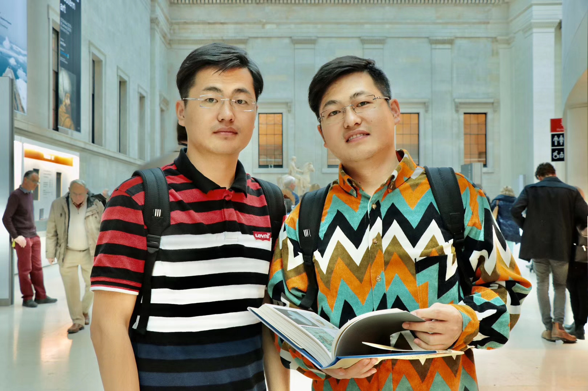
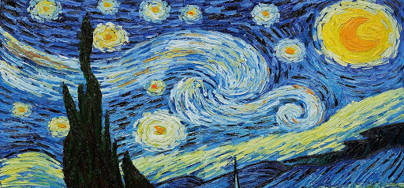
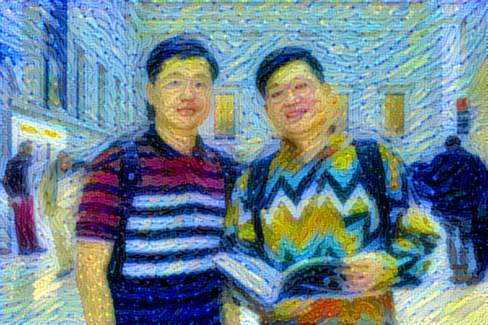

# Keras examples directory

## Vision models examples

[mnist_mlp.py](mnist_mlp.py)
Trains a simple deep multi-layer perceptron on the MNIST dataset.

[mnist_cnn.py](mnist_cnn.py)
Trains a simple convnet on the MNIST dataset.

[cifar10_cnn.py](cifar10_cnn.py)
Trains a simple deep CNN on the CIFAR10 small images dataset.

[cifar10_cnn_capsule.py](cifar10_cnn_capsule.py)
Trains a simple CNN-Capsule Network on the CIFAR10 small images dataset.

[cifar10_resnet.py](cifar10_resnet.py)
Trains a ResNet on the CIFAR10 small images dataset.

[conv_lstm.py](conv_lstm.py)
Demonstrates the use of a convolutional LSTM network.

[image_ocr.py](image_ocr.py)
Trains a convolutional stack followed by a recurrent stack and a CTC logloss function to perform optical character recognition (OCR).

[mnist_acgan.py](mnist_acgan.py)
Implementation of AC-GAN (Auxiliary Classifier GAN) on the MNIST dataset

[mnist_hierarchical_rnn.py](mnist_hierarchical_rnn.py)
Trains a Hierarchical RNN (HRNN) to classify MNIST digits.

[mnist_siamese.py](mnist_siamese.py)
Trains a Siamese multi-layer perceptron on pairs of digits from the MNIST dataset.

[mnist_swwae.py](mnist_swwae.py)
Trains a Stacked What-Where AutoEncoder built on residual blocks on the MNIST dataset.

[mnist_transfer_cnn.py](mnist_transfer_cnn.py)
Transfer learning toy example on the MNIST dataset.

[mnist_denoising_autoencoder.py](mnist_denoising_autoencoder.py)
Trains a denoising autoencoder on the MNIST dataset.

----

## Text & sequences examples

[addition_rnn.py](addition_rnn.py)
Implementation of sequence to sequence learning for performing addition of two numbers (as strings).

[babi_rnn.py](babi_rnn.py)
Trains a two-branch recurrent network on the bAbI dataset for reading comprehension.

[babi_memnn.py](babi_memnn.py)
Trains a memory network on the bAbI dataset for reading comprehension.

[imdb_bidirectional_lstm.py](imdb_bidirectional_lstm.py)
Trains a Bidirectional LSTM on the IMDB sentiment classification task.

[imdb_cnn.py](imdb_cnn.py)
Demonstrates the use of Convolution1D for text classification.

[imdb_cnn_lstm.py](imdb_cnn_lstm.py)
Trains a convolutional stack followed by a recurrent stack network on the IMDB sentiment classification task.

[imdb_fasttext.py](imdb_fasttext.py)
Trains a FastText model on the IMDB sentiment classification task.

[imdb_lstm.py](imdb_lstm.py)
Trains an LSTM model on the IMDB sentiment classification task.

[lstm_stateful.py](lstm_stateful.py)
Demonstrates how to use stateful RNNs to model long sequences efficiently.

[lstm_seq2seq.py](lstm_seq2seq.py)
Trains a basic character-level sequence-to-sequence model.

[lstm_seq2seq_restore.py](lstm_seq2seq_restore.py)
Restores a character-level sequence to sequence model from disk (saved by [lstm_seq2seq.py](lstm_seq2seq.py)) and uses it to generate predictions.

[pretrained_word_embeddings.py](pretrained_word_embeddings.py)
Loads pre-trained word embeddings (GloVe embeddings) into a frozen Keras Embedding layer, and uses it to train a text classification model on the 20 Newsgroup dataset.

[reuters_mlp.py](reuters_mlp.py)
Trains and evaluate a simple MLP on the Reuters newswire topic classification task.

----

## Generative models examples

[lstm_text_generation.py](lstm_text_generation.py)
Generates text from Nietzsche's writings.

[conv_filter_visualization.py](conv_filter_visualization.py)
Visualization of the filters of VGG16, via gradient ascent in input space.

[deep_dream.py](deep_dream.py)
Deep Dreams in Keras.

[neural_doodle.py](neural_doodle.py)
Neural doodle.

[neural_style_transfer.py](neural_style_transfer.py)
Neural style transfer.

[variational_autoencoder.py](variational_autoencoder.py)
Demonstrates how to build a variational autoencoder.

[variational_autoencoder_deconv.py](variational_autoencoder_deconv.py)
Demonstrates how to build a variational autoencoder with Keras using deconvolution layers.

----

## Examples demonstrating specific Keras functionality

[antirectifier.py](antirectifier.py)
Demonstrates how to write custom layers for Keras.

[mnist_sklearn_wrapper.py](mnist_sklearn_wrapper.py)
Demonstrates how to use the sklearn wrapper.

[mnist_irnn.py](mnist_irnn.py)
Reproduction of the IRNN experiment with pixel-by-pixel sequential MNIST in "A Simple Way to Initialize Recurrent Networks of Rectified Linear Units" by Le et al.

[mnist_net2net.py](mnist_net2net.py)
Reproduction of the Net2Net experiment with MNIST in "Net2Net: Accelerating Learning via Knowledge Transfer".

[reuters_mlp_relu_vs_selu.py](reuters_mlp_relu_vs_selu.py)
Compares self-normalizing MLPs with regular MLPs.

[mnist_tfrecord.py](mnist_tfrecord.py)
MNIST dataset with TFRecords, the standard TensorFlow data format.

[mnist_dataset_api.py](mnist_dataset_api.py)
MNIST dataset with TensorFlow's Dataset API.

[cifar10_cnn_tfaugment2d.py](cifar10_cnn_tfaugment2d.py)
Trains a simple deep CNN on the CIFAR10 small images dataset using Tensorflow internal augmentation APIs.

[tensorboard_embeddings_mnist.py](tensorboard_embeddings_mnist.py)
Trains a simple convnet on the MNIST dataset and embeds test data which can be later visualized using TensorBoard's Embedding Projector.

------------------------------------------------

# Results

## neural_style_transfer

{:height="500px" width="500px"}  Twins
 starry night
 starry night

----

* hello word!

* [twins](twins.JPG)

* [starry night](starry_night.jpg)

* [ChengxiHan](https://github.com/ChengxiHAN)

